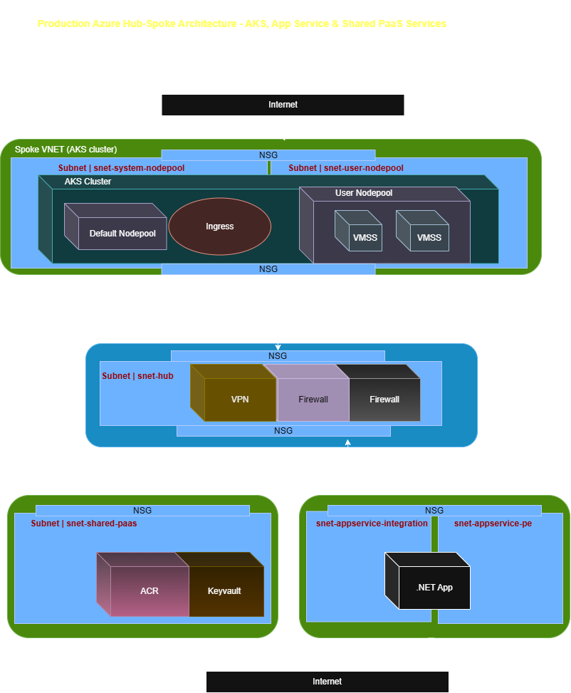

# delphi-case-study
Senior Software Engineer | Case Study DevOps | Project

This is a case study project which would be developed as cloud native app and deployed to the Azure cloud.

## Overview:
This project delivers Terraform modules for Azure Network, AKS Cluster, Azure container registry, keyvault, App service, two Azure DevOps Pipelines, K8S menifests for a sample microservice application and a BOQ for UAE North and the production principles it follows (HA, Security, network isolation)

## Architecture

- Hub-spoke topology: AKS spoke (system(default) + user nodepools), App Service spoke (VNet integration + private endpoints subnets), shared-PaaS spoke (ACR, KeyVault).
- key Descisions
    - Private endpoints for ACR,KeyVault and app service, no public network access
    - Private DNS zones centralized in hub, spokes forward via firewall DNS proxy
    - Nginx ingress path for inbout app traffic, separate from hub
    - Azure CNI for AKS (Network Policy Support), zone-redundant node pools
    - 

## Repository Structure
/delphi-case-study
    /terraform
        /modules            (aks, acr, keyvault, appservice, networking)
        /environments/prod
    /k8s                    (deploy, service, ingress, hpa, storageclass, pvc)
    /pipelines              (terraform-pipeline.yml, dotnet-app-pipeline.yml)
    /docs                   (network-arch.drawio.png)